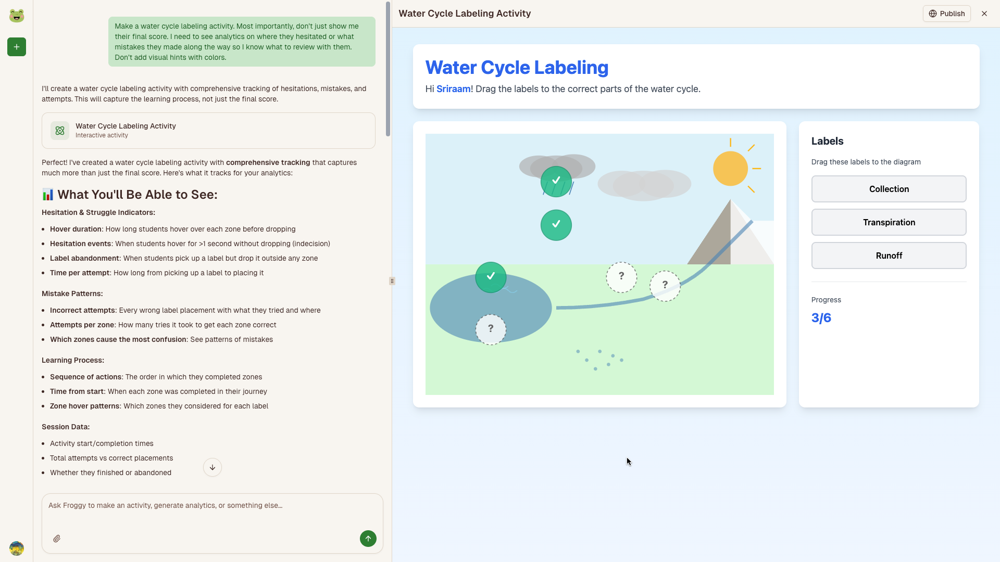
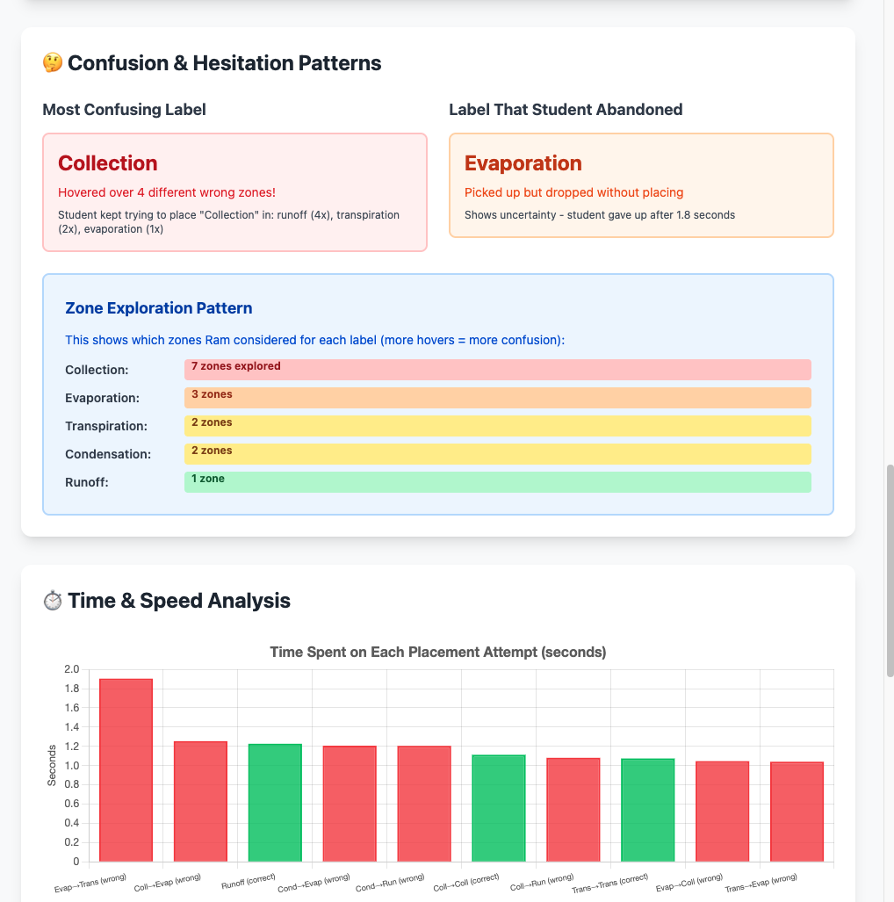
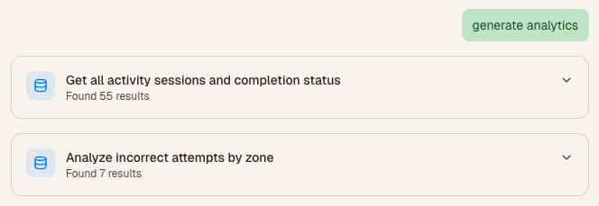

# Froggy - See _how_ students think and not just their scores

An open-source AI-powered platform for educators to create interactive educational activities and analyze student learning patterns that goes beyond their scores.


## ✨ Features

### 🎯 Interactive Activity Creation

- **AI-Powered Generation**: Describe your activity idea in plain English, and Froggy generates a complete interactive experience
- **Publish & Share**: One-click publishing with shareable links for students
- **Fully Customizable**: Activities are generated with Tailwind CSS and vanilla JavaScript for maximum flexibility
- **Private by Default**: We do not store student PII data. They only enter their name or username



### 📊 Learning Analytics

- **Student Event Tracking**: Automatically track student interactions, progress, and outcomes
- **SQL-Powered Queries**: Query student data using flexible SQL queries with a user-friendly interface
- **Visual Dashboards**: Generate custom analytics visualizations with charts, tables, and insights
- **Process-Oriented Data**: Track not just outcomes, but the learning process itself



### 🔍 Query Events Tool

- **Flexible Data Analysis**: Run custom SQL queries against student event data
- **Educator-Friendly UI**: Technical queries presented in a simple, collapsible card interface



## 🛠️ Tech Stack

- **Frontend**: Next.js, React, TypeScript, Tailwind CSS
- **UI Components**: Shadcn/ui, Radix UI
- **AI**: Claude Sonnet 4.5, Vercel AI SDK
- **Database**: PostgreSQL(Neon) with Drizzle ORM
- **Authentication**: Clerk

## 🚀 Getting Started

### Prerequisites

- Node.js
- Neon database
- Clerk account
- Anthropic API key

### Installation

1. Clone the repository:

```bash
git clone https://github.com/13point5/froggy.git
cd froggy
```

2. Install dependencies:

```bash
npm install
```

3. Set up environment variables:

```bash
cp .env.example .env.local
```

Configure the following variables:

```env
NEXT_PUBLIC_CLERK_PUBLISHABLE_KEY=
CLERK_SECRET_KEY=

NEXT_PUBLIC_CLERK_SIGN_IN_URL=/sign-in
NEXT_PUBLIC_CLERK_SIGN_UP_URL=/sign-up
NEXT_PUBLIC_CLERK_SIGN_IN_FALLBACK_REDIRECT_URL=/
NEXT_PUBLIC_CLERK_SIGN_UP_FALLBACK_REDIRECT_URL=/

DATABASE_URL=

ANTHROPIC_API_KEY=
```

4. Run database migrations:

```bash
npx drizzle-kit migrate
```

5. Start the app:

```bash
npm run dev
```

6. Open [http://localhost:3000](http://localhost:3000)

## 🤝 Contributing

Contributions are welcome! Please feel free to submit a Pull Request.

## 📄 License

MIT
